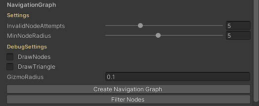

## MassiveDesigner

MassiveDesigner is a level design editor plugin for Unity, it has tools for both procedural and manual level design as well as tools for creating believable AI characters.  
With a group based workflow for organizing your objects and that can be saved and reloaded across multiple scenes and projects MD will give you completely fresh level design experience with tools for both world building and AI under one window.  

Some of these tools are completely free and opensource and you can kick start your level design and modify them to your liking however for more advanced users and bigger projects there other tools available through a patreon subscription, the patreon page contains some other goodies such as level design and AI tutorials, visit the patreon page here.

This repository contains instructions for installing MassiveDesigner as well as documentation for all tools and settings.  

There is discord sever if you want to meet other developers using MassiveDesigner.  

>  _In MassiveDesigner almost all GUI elements have an associated tool-tip detailing its usage, to see a tool-tip, hover mouse cursor over any button or GUI element to see what it does._

> _For any suggestion, feedback or feature request email at CodeCreatePlay360@gmail.com_

## Installation
Download this repository and put it under Assets directory in your project or you can install from one of the packages.

## Creating a MassiveDesigner instance

To create a new **MassiveDesigner** instance, create an empty game object and add the **MassiveDesigner** component.

The main window has 3 subsections
1. **World** is where the level design tools are located.
2. **LocationTool** is used to create and define locations in game world mainly to be used by AI characters during decision making and navigation stage.
3. **Settings** contains global settings common to all tools. 

****
# World
This section mostly contains tools for designing game world such as vegetating painting, creating roads, rivers, pathways etc.

## Setting up a SpawnTiles instance

Before any spawn operations, you need to have a working **SpawnTiles** setup, objects will be spawned and stored in these tiles, spawn tiles can be initialized from settings window, **Settings > InitializeSpawnTiles.**  
Turn on **DebugTiles** under **DebugOptions** to visualize the tiles.

## Layer

To group together similar objects **MassiveDesigner** uses concept of **Layers**, **Layers** should contain only one type of closely related objects for example trees, grasses and rocks should be placed in separate layers. The type of objects stored in a layer can be set in layer properties.  

To disable a **Layer** uncheck the toggle button next to a **Layer**.  
You can also copy a **Layer's settings** and paste it on another Layer (using the copy/paste buttons next to Layer).  

| Setting | Description |
| --- | --- |
| ItemsType | Type of items stored in this layer |
| Priority | Layer's priority |
| LayerMask | Unity's LayerMask you want to paint on |
| Sparse | Decrease in density of spawned objects |
| SplatLayers | The index of unity terrain's splat layer to paint on, objects will only be spawned on these splat layer, set this to -1 to turn this feature off, to spawn on more than one layer, put a comma in between different indexes (1, 3, 4) |
| UseTerrainTextureStrength | If true, less objects will be spawned in areas with lower terrain texture strength/opacity |

## PaintMesh

A **PaintMesh** is the spawn object, any object you want to spawn via any tool should have this component.  
To create a new **PaintMesh**, add the **PaintMesh** component to any GameObject you want to spawn.  
**PaintMeshes** can be spawned only after they have been added to **MassiveDesigner Layer**, to add a **PaintMesh** to a **MassiveDesigner Layer**, drag them to the **LayerPrototypes** section of a **MassiveDesigner Layer**.  

**MassiveDesigner** uses its own collision system, a **PaintMesh** can contain 2 colliders at most, for example some objects like trees are better defined using 2 colliders, one for tree trunk and one for top branches (you can use just one collider if you want, however trees or similar objects are better defined using two colliders).  
All collision related settings are defined under **PaintMesh > CollisionSettings**.
* First collider of any **PaintMesh** is origin at pivot of GameObject, it is defined using **FirstColliderRadius**.
* The second collider is defined using **SecondColliderRadius** and its position can be offset using **SecondColliderOffset**.

**Setting**

| Setting | Description |
| --- | --- |
| SpecieName | Name of this specie, items of similar species for example different variations of **Birch trees** should have same specie name |
| **SpecieSettings** | |
| SpawnProbability | Increases the chance of selecting this paint mesh compared to other **PaintMeshes** from this layer |
| SurvivalRate | Increases chances of survival (only valid for foliage simulation tools) |
| DispersionStrength | Probability of spawn of items of same specie close to each other (only valid for foliage simulation tools) |
| **CollisionSettings** | |
| FirstColliderRadius | Radius of first collider, origin at pivot point |
| SecondColliderRadius | Radius of second collider, origin at SecondColliderOffset (valid only if layer items types is trees) |
| FirstColliderOffset | Offset of first collider from origin |
| SecondColliderOffset | Offset of second collider from origin |
| UseFirstColliderOnly | Detect collision only on first collider only |
| **Variation** | |
| ScaleMultiplier | Scales the size of PaintMeshes, use this if you want to globally increase or decrease size of this PaintMesh when spawned |
| Scale variation | -- |
| RotationVariation | Rotation variation along x-z plane |
| **Debug** | |
| Debug | Draw a visual representation of colliders for debugging. |
| DrawFirstCollider | If checked draws the a visual representation of first collider |
| DrawSecondCollider | If checked draws the a visual representation of second collider |

**Debugging a PaintMesh**  
  At most you would want to visualize colliders of a **PaintMesh** for debugging purpose, to debug import any GameObject with **PaintMesh** component into scene and toggle on Debug under **PaintMesh** debug settings.

## FoliagePainter

FoliagePainter is manual vegetation painting system of **MassiveDesigner**, objects are spawned as unity terrain tree objects, the FoliagePainter is fast and more useful at painting large objects like trees, however it can still be used to scatter small objects like grasses at a very fast rate if brush size is small.  
To begin painting a valid unity terrain should exist in scene with a **SpawnTiles** instance covering entire terrain....after everything is setup  
* control + right click drag to start painting
* shift + right click drag to remove paint

**Setting**

| Setting | Description |
| --- | --- |
| **PaintSettings** | |
| PaintMode |**Normal:** Object is not spawned if a collision is detected |
| | **Replace:** Replaces objects with lower priorities with higher priority objects (A **PaintMesh's** priority is same as a Layer priority). |
| PaintRadius | (Green circle) Spawning will take place in this radius |
| Use All Layers | If checked, spawner will select PaintMeshes from all Layers, otherwise PaintMeshes only from the selected Layer will be selected for spawn |
| WeightedSelection | If this is checked, more spawn chance will be given to PaintMeshes with higher spawn priorities. |
| **EraseSettings** | |
| RemoveRadius | (Red circle) Spawned objects will be removed in this radius |
| RemoveOnlyOnSelectedLayer | Set this to true to only remove PaintMeshes from selected layer |
| **BrushSettings** | |
| SpawnDelay | Delay before next spawn operation, for most cases this should be set to **0.1**, settings this to a lower number will effect performance a lot. |
| Opacity | Scales number of spawns per each spawn operation....by default number of spawns for each spawn op is same as PaintRadius |
 
## GrassPainter

Spawns objects as unity terrain details, either globally or in a defined location.

**Setting**

| Setting | Description |
| --- | --- |
| **PaintSettings** | |
| Use_All_Layers | If checked, spawner will select PaintMeshes from all Layers, otherwise PaintMeshes only from the selected Layer will be selected for spawn |
| UseWightedProbability | If checked, more spawn chance will be given to PaintMeshes with higher spawn priorities. |
| UseSimulation | Use simulation ? |
| InsideArea | (Only valid for area paint mode) If checked spawn objects inside boundaries of area otherwise outside |
| SpawnOnlyInCameraFOV | Spawns only in camera FOV, useful of you want to take screenshot with grass, without having to spawn on entire terrain |
| FixedCount | If checked, spawns only on a fixed number of randomly selected cells, useful if you want to scatter some item randomly |
| SpawmCount | If **FixedCount** is checked, determines the number of objects to be spawned, where maximum number of objects is **_Detail resolution * Detail resolution_**. |
| DetailResolutionPerPatch | -- |
| DetailResolution | -- |
| **SimulationSettings** | |
| SeedCount | Initial number of seeds spawned (per each PaintMesh) for simulation |
| **RemoveSettings** | |
| RemoveOnlyOnSelectedLayer | If checked, items only from the selected Layer will be removed when **Clear** button is pressed. |
| RemoveFromInsideArea | If checked, remove objects only from inside the boundaries of area when **Clear** button is pressed, otherwise removes from outside. |
| **Debug** | |
| Debug | -- |

## Other
### 1. __Serialization
**MassiveDesigner** does not automatically serializes data, when entering play mode or during editor reload, data will be lost, so you will have to manually save and reload data and for that you will have to create a new MD save file script-able object **Create > MassiveDesigner > SaveData** and hook this into **Settings > SaveDataObj**, after that go to **World > Save Data/Reload Data From File** to actually save and reload data.  
You can have multiple variations of **SaveData** files to have multiple variations of world design in same level.

# Location_Tool

The purpose of this tool is to define locations in game world to be used by AI characters during navigation and decision making stage.  
Game objects which otherwise are nothing but static meshes can have meaning associated to them and have boundaries and special destinations assigned.  

An example would during rain the AI characters can search for nearest locations of type **Rain Shelter**, this could be their home or anything and move there.

All locations are stored globally in an **LT_Globals** static class and provide methods to access locations based on various parameters such as nearest location of type, location by name etc.

Besides this location tool provides some enhanced navigation systems build on top of Unity's navmesh.  
For a complete step by step on usage on this tool visit the tutorial section.

****
## Known issues
1. 

## Roadmap
**For version 1.0**
1. There is no dedicated renderer, foliage is spawned either as Unity terrain tree objects or a terrain detail object, so a foliage renderer is top most priority for v1.0.
2. Add builtin foliage and terrain shaders.
3. Streaming support for **SpawnTiles**.
4. Some decision making algorithm (probably GOAP or BT) for AI characters.
5. Massive designer's Layers will be changed to scriptable **"MD_Group"** objects to make them more flexible to reuse across multiple scenes and projects.

## Support
* [Discord](--)
* CodeCreatePlay360@gmail.com

****
## Tutorials
### __Creating a forest using using MassiveDesigner

Open the demo scene, **MassiveDesigner > Demo > WorldDesign > Scenes > WorldDesignDemo**, it has a terrain game object and some post processing set up.

|  |
| :--: |
|  |
| Demo environment |

Create the unique unity LayerMask, rename it appropriately and set your terrain to use this LayerMask.  

Add an empty game object and add the MassiveDesigner component.  

First you will need all the assets, some trees, bushes and grasses, wild flowers, rocks etc.

|  |
| :--: |
|  |
| Foliage assets | 

Drag them into the scene and add the **PaintMesh** component to them, in scene view the only setting that matters is **Collision setting**, all other settings can be modified on the fly (_MD uses its own simplified collision system for collision detection during spawn_), **Trees are best defined using two colliders one for base trunk and one for top branches, all other objects can be defined using one collider, however this is only for convenience, the behavior can be changed.**  

In **PaintMesh** settings turn on all debug options under **Debug** label and tweak colliders radii and offsets to roughly fit your mesh.

|  |
| :--: |
| Collision settings | 

Before any spawn operation you need a **SpawnTiles** instance covering the entire terrain, this can be set via **MD > Settings > CreateTiles**, its OK if your terrain size and **SpawnTiles** grid size do not match.  

|  |
| :--: |
| Spawn tiles covering entire terrain |

Next step is creating the MD layers, to keep things simple, I have only created 5 Layers, it is convenient if Layers are arranged in some order, for example I have set them to descending order of their collision radii, but you can go in any order you like.  
Also make sure to set the LayerMask property for all MD Layers to use the LayerMask you have set for terrain game object.  

|  |
| :--: |
| Basic Layers setup |

As you can see in the demo environments screen shots, terrain has two distinct features mainly the cliffs and flat ground, we only want to paint foliage on flat ground and not on cliffs, excluding these areas manually would be very time consuming, so we would automate this by setting our MD Layers to paint only on selective terrain texture layers, do this by typing in the terrain texture layers indexes separated by comma in a MD Layer's **SplatLayers** property.

|  |
| :--: |
| Terrain layers of this demo environment |

|  |
| :--: |
| SplatLayer property of MD Layer corresponding to terrain layers |

Larger scene elements should be scattered first, so we will begin by scattering the trees from the first two layers, open the **FoliagePainter** tool drop down,
Select the first layer to start scattering the first group of trees, make sure **UseAllLayers** property of **FoliagePainter** is toggled off.  
* Click the **Start Paint** button and in the scene view hold **control + left mouse button** to begin paint.
* To remove paint **shift + left mouse button**.

Now to spawn from second Layer, select the second Layer, increase its **PriorityIdx** value and in the **FoliagePainter** tool, set the **PaintMode** to **Replace**, this would replace any colliding items from Layers of lower priorities with items of higher priority values.  
Now paint over the trees from the first Layer.

|  |
| :--: |
|  |
| Trees |

Select the third **Layer** I.E bushes, set brush mode to **Normal** and start painting the bushes, since their radii is small, they would be spawned in between the trees.

|  |
| :--: |
| Trees + bushes |

Now its time to scatter the grass, unlike the trees grass can only be scattered globally or for more precise control, within some defined boundaries.  
There are a lot of settings in **GrassPainter** tool, however here we only need to spawn globally, select the Layer with grasses in it, and hit the **Paint** button, modify the **Density** property to get more or less grass.

|  |
| :--: |
|  |
| Trees + bushes + Grasses |

Finally to scatter the wild flowers, select the Layer with the flowers and repeat the steps just like for grass scattering.

|  |
| :--: |
|  |
| Final result |