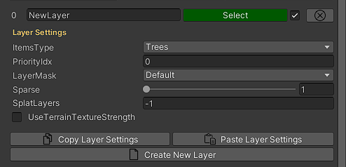
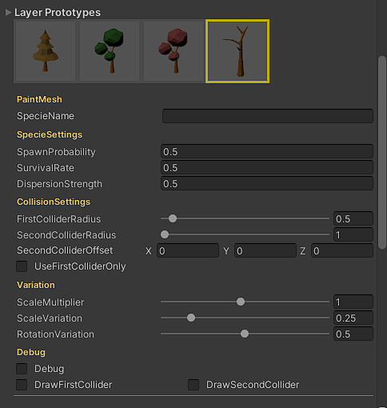
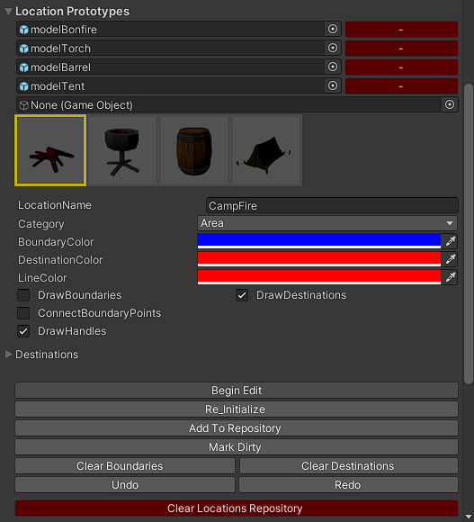
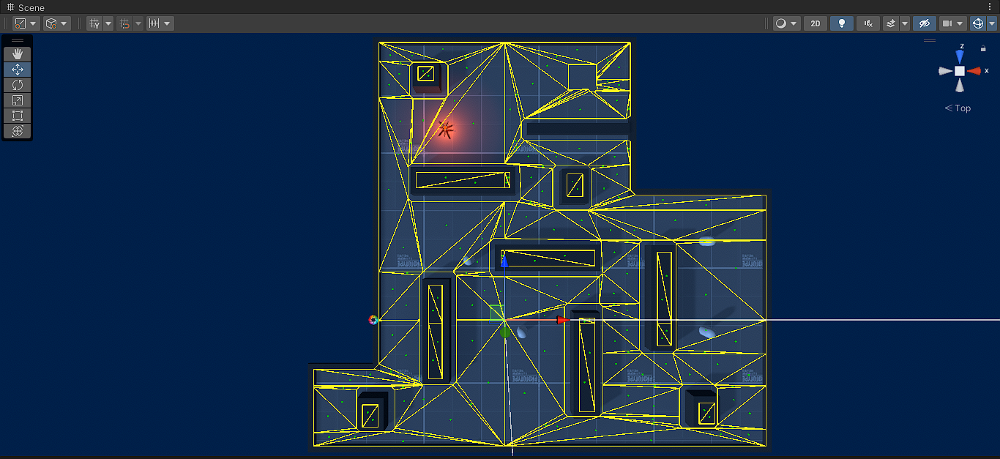

## MassiveDesigner

MassiveDesigner is a level design and AI characters authoring tool for Unity engine.  

Some of these tools are completely free and opensource and you can kick start your level design and modify them to your liking however for bigger projects there are advanced tools available through a patreon subscription, the patreon page contains some other goodies such as level design and AI programming tutorials.

This repository contains instructions for installing MassiveDesigner as well as documentation for all tools and settings.  

There is discord sever if you want to meet other developers using MassiveDesigner.  

>  _In MassiveDesigner almost all GUI elements have an associated tool-tip detailing its usage, to see a tool-tip, hover mouse cursor over any button or GUI element to see what it does._

> _For any suggestion, feedback or feature request email at CodeCreatePlay360@gmail.com_

## Important links
1. [Discord](https://discord.gg/ZbYRKtN6pg "discord")
2. [Patreon](https://www.patreon.com/posts/welcome-57582973?utm_medium=clipboard_copy&utm_source=copyLink&utm_campaign=postshare_creator&utm_content=join_link)

## Installation
Download this repository and put it under Assets directory in your project or you can install from one of the packages.

## Creating a MassiveDesigner instance

To create a new **MassiveDesigner** instance, create an empty game object and add the **MassiveDesigner** component.

The main window has 3 subsections
1. **World** is where the level design tools are located.
2. **LocationTool** primary purpose of this tool is to create locations in game world, mainly to be used by AI characters during decision making and navigation stage.
3. **Settings** contains global settings common to all tools. 


****
# World
This section mostly contains tools for designing game world such as vegetating painting, creating roads, rivers, pathways etc.

## Setting up a SpawnTiles instance

Before any spawn operations, you need to have a working **SpawnTiles** setup, objects will be spawned and stored in these tiles, spawn tiles can be initialized from settings window, **Settings > InitializeSpawnTiles.**  
Turn on **DebugTiles** under **DebugOptions** to visualize the tiles.


## Layer



To group together similar objects **MassiveDesigner** uses concept of **Layers**, **Layers** should contain only one type of closely related objects for example trees, grasses and rocks should be placed in separate layers. The type of objects stored in a layer can be set in layer properties.  

To disable a **Layer** uncheck the toggle button next to a **Layer**.  
You can also copy a **Layer's settings** and paste it on another Layer (using the copy/paste buttons next to Layer).  

| Setting | Description |
| --- | --- |
| ItemsType | Type of items stored in this layer |
| Priority | Layer's priority |
| LayerMask | Unity's LayerMask you want to paint on |
| Sparse | Density of spawn from this Layer |
| SplatLayers | The index of unity terrain's splat layer to paint on, objects will only be spawned on these splat layer, set this to -1 to turn this feature off, to spawn on more than one layer, put a comma in between different indexes (1, 3, 4) |
| UseTerrainTextureStrength | If true, less objects will be spawned in areas with lower terrain texture strength/opacity |

## PaintMesh



A **PaintMesh** is the spawn object, any object you want to spawn via any tool should have this component.  
To create a new **PaintMesh**, add the **PaintMesh** component to any GameObject you want to spawn.  
**PaintMeshes** can be spawned only after they have been added to **MassiveDesigner Layer**, to add a **PaintMesh** to a **MassiveDesigner Layer**, drag them to the **LayerPrototypes** section of a **MassiveDesigner Layer**.  

**MassiveDesigner** uses its own collision system, a **PaintMesh** can contain 2 colliders at most, for example some objects like trees are better defined using 2 colliders, one for tree trunk and one for top branches (you can use just one collider if you want, however trees or similar objects are better defined using two colliders).  
All collision related settings are defined under **PaintMesh > CollisionSettings**.
* First collider of any **PaintMesh** is origin at pivot of GameObject, it is defined using **FirstColliderRadius**.
* The second collider is defined using **SecondColliderRadius** and its position can be offset using **SecondColliderOffset**.

**Setting**

| Setting | Description |
| --- | --- |
| SpecieName | Name of this specie, items of similar species for example different variations of Birch trees should have same specie name |
| **SpecieSettings** | |
| SpawnProbability | Increases the chance of selecting this PaintMeshes compared to other PaintMeshes from this layer |
| SurvivalRate | Increases chances of survival (only valid for foliage simulation tools) |
| DispersionStrength | Probability of spawn of items of same specie close to each other (only valid for foliage simulation tools) |
| **CollisionSettings** | |
| FirstColliderRadius | Radius of first collider, origin at pivot point |
| SecondColliderRadius | Radius of second collider, origin at SecondColliderOffset |
| FirstColliderOffset | Offset of first collider from origin |
| SecondColliderOffset | Offset of second collider from origin |
| UseFirstColliderOnly | Detect collision only on first collider only |
| **Variation** | |
| ScaleMultiplier | Scales the size of PaintMeshes, use this if you want to globally increase or decrease size of this PaintMesh when spawned |
| Scale variation | -- |
| RotationVariation | Rotation variation along x-z plane |
| **Debug** | |
| Debug | Draw a visual representation of colliders for debugging. |
| DrawFirstCollider | If checked draws the a visual representation of first collider |
| DrawSecondCollider | If checked draws the a visual representation of second collider |

**Debugging a PaintMesh**  
  At most you would want to visualize colliders of a **PaintMesh** for debugging purpose, to debug import any GameObject with **PaintMesh** component into scene and toggle on Debug under **PaintMesh** debug settings.

https://user-images.githubusercontent.com/104358085/207950766-d70555ea-5ef5-49b5-bb43-7d40e49eb8f9.mp4

## FoliagePainter


FoliagePainter is manual vegetation painting system of **MassiveDesigner**, objects are spawned as unity terrain tree objects, the FoliagePainter is fast and more useful at painting large objects like trees, however it can still be used to scatter small objects like grasses at a very fast rate if brush size is small.  
To begin painting a valid unity terrain should exist in scene with a **SpawnTiles** instance covering entire terrain....after everything is setup  
* control + right click drag to start painting
* shift + right click drag to remove paint

https://user-images.githubusercontent.com/104358085/208910282-fb1e817d-a13a-4bb6-b759-b5d8c3d35997.mp4

**Setting**

| Setting | Description |
| --- | --- |
| **PaintSettings** | |
| PaintMode |**Normal:** Object is not spawned if a collision is detected |
| | **Replace:** Replaces objects with lower priorities with higher priority objects (A **PaintMesh's** priority is same as a Layer priority). |
| LayerMask | The LayerMask of GameObject to paint on |
| PaintRadius | (Green circle) Spawning will take place in this radius |
| Use All Layers | If checked, spawner will select PaintMeshes from all Layers, otherwise PaintMeshes only from the selected Layer will be selected for spawn |
| WeightedSelection | If this is checked, more spawn chance will be given to PaintMeshes with higher spawn priorities. |
| OverrideGroupLayerMask | If checked, uses the LayerMask set in this tool's settings otherwise MD-Layer's LayerMask is used. |
| **EraseSettings** | |
| RemoveRadius | (Red circle) Spawned objects will be removed in this radius |
| RemoveOnlyOnSelectedLayer | Set this to true to only remove PaintMeshes from selected layer |
| **BrushSettings** | |
| SpawnDelay | Delay before next spawn operation, for most cases this should be set to **0.1**, settings this to a lower number will effect performance a lot. |
| Opacity | Scales number of spawns per each spawn operation....by default number of spawns for each spawn op is same as PaintRadius |
 
## Other
### 1. __Serialization
**MassiveDesigner** does not automatically serializes data, when entering play mode or during editor reload, data will be lost, so you will have to manually save and reload data and for that you will have to create a new MD save file script-able object **Create > MassiveDesigner > SaveData** and hook this into **Settings > SaveDataObj**, after that go to **World > Save Data/Reload Data From File** to actually save and reload data.  
You can have multiple variations of **SaveData** files to have multiple variations of world design in same level.

https://user-images.githubusercontent.com/104358085/207950593-a47eb39e-42fe-49c9-975c-555eee15f2e6.mp4

# Location_Tool

Location tool is designed to create and define locations or destinations in game world, to be used by AI characters during decision making and navigation stage.  
This tool also offers some additional features, such as tools to clean up isolated areas in a NavMesh and a tool to create a navigation graph out of NavMesh for AI characters.

## Location Editor

The LocationEditor can convert any game object to a Location, after an object is converted to a Location, its boundaries, important destinations in that Location along with several other properties can be defined.  
To convert an existing game object to Location, go to menu bar **CodeCreatePlay > ConvertToLocation**.  
1. To create boundaries, select the location and **control + left mouse button**.
2. And to create destination, select the location, **control + right mouse button**.

https://user-images.githubusercontent.com/104358085/209680054-557a6c5d-50eb-4149-aea6-471a43f0e35b.mp4

All location are stored in "LT_Globals" static class and can be accessed via its instance, 

```
            // all location can be accessed via LT_Globals instance
            LocationBase loc1 = LT_Globals.Instance.GetNearestLocation(transform.position, LocationCategory.Area);
            LocationBase loc3 = LT_Globals.Instance.GetRandomLocation(LocationCategory.Area);
```

Similarly to get a reference to individual destinations in a location,

```
            // getting references to destinations inside a location
            LocationBase location = LT_Globals.Instance.GetLocation("Fireplace");
            Destination d1 = location.GetRandomDestination();
            Destination d2 = location.GetDestinationByName("Some name");
            Destination d3 = location.GetNextDestination(); // get next unoccupied location, returns null if all are occupied
```

## Navigation Graph

The NavigationGraph tool create a graph by connecting midpoints (nodes) of every triangle in NavMesh, this navigation graph can be used for various purposes for example AI character finding objects on a NavMesh.  
Individual nodes can be put into AI character's memory so it doesn't visit same area twice. 
Individual navigation nodes can be accessed through "NavigationGraph" static class,

```
            Vector3 p1 = EnhancedNavigation.Instance.GetClosestNodePos(transform.position); // closest node position
            Vector3 p2 = EnhancedNavigation.Instance.GetRandomNodePos(); // random node position
```



## Demonstration
There is few demos of this tool, included in demo folder.  
1. **Demo 1 Fireplace**, contains a simple fireplace location around which characters can sit, the fireplace consumes two elements gasoline and firewood to keep burning, as either one of the element is completely consumed, a character will have to search the map for missing element.  
The two important scripts are "AI_Manager.cs" and "AI_Character.cs".
    * "AI_Manager" has a reference to fireplace location and tasks a random AI character to look for the missing element.
    * The "AI_Character" class represents a humanoid character, with four states, represented as enumeration, the actual states are implemented in their respective methods inside the "AI_Character" class.  

https://user-images.githubusercontent.com/104358085/209680171-5315057c-5c84-4e74-8dee-6fcbc2446858.mp4

## Known Issues
Sometimes the location editor losses reference to the active location even if you select it in the inspector, causing a null reference exception error, this can simply be fixed by re-initializing the location.

****

## Roadmap
**For version 1.0**
1. There is no dedicated renderer, foliage is spawned either as Unity terrain tree objects or a terrain detail object, so a foliage renderer is top most priority for v1.0.
2. Add builtin foliage and terrain shaders.
3. Streaming support for **SpawnTiles**.
4. Some decision making algorithm (probably GOAP or BT) for AI characters.
5. Massive designer's Layers will be changed to scriptable **"MD_Group"** objects to make them more flexible to reuse across multiple scenes and projects.
6. FoliagePainter will generalized to spawn PaintMeshes as GameObjects as well and probably be renamed to **Painter**.

## Support
* [Discord](https://discord.gg/ZbYRKtN6pg "discord")
* CodeCreatePlay360@gmail.com
